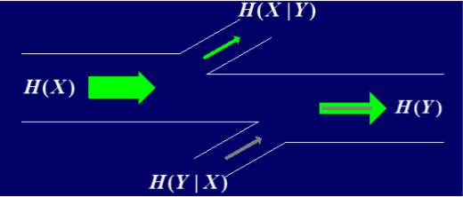

[密码学题库](https://www.cnblogs.com/tomyyyyy/p/11094204.html)

## MOOC真题

### 第一周 古典密码

1. 若仿射变换f(x)=17x+9(mod 26)的逆变换是g(y)=ay+b(mod 26)，则ab(mod26)的值为________
   
   **23**
   
2. ​设置换加密A将明文"abcdefg"加密为"dfabgec"，那么至少经过________次加密，A总是可以将任意明文加密成该明文本身。
   
   **7**

3. ‍考虑$Z_2$上四级线性递归序列$z_{i+4}=(z_i+z_{i+1}+z_{i+2})mod2$，试问对于初始向量1101，其生成的密钥流的周期是________
   
   **7**

4. 已知某分组长度为3的Hill密码将明文determinants加密成密文KQDCFDIJLXRG，试问在该加密算法下，密文NOP对应的明文是________(小写英文字母)。
   
   **toy**

### 第二周 香农理论

1. 已知一密码体制的加密矩阵为$\begin{array} {ccc}{} & {a} & {b} \\ {k_{1}} & {1} & {2} \\ {k_{2}} & {2} & {1} \end{array}$，其中$Pr[a]=\frac{1}{5}$，$Pr[k_1]=\frac{1}{4}$，试计算：$Pr[1]=$________（四舍五入保留两位小数）
   
   **0.65**
   
2. 密码体制同问题1，试计算：$PR[b|2]+Pr[2|b]=$________（四舍五入保留两位小数）
   
   **0.82**

3. 密码体制同问题1，试计算：$H(P|C)=$________比特（四舍五入保留两位小数）
   
   **0.60**

4. 采用分组长度为128比特，密钥长度为256比特的AES加密算法加密明文，假设密钥均匀随机选取，明文是冗余度为0.75的小写英文字母，试计算至少需要________(向上取整)组密文可以唯一确定加密密钥。
   
   **5**

5. 香农通信模型如图所示：
   
   
   
   它表明信道中存在噪声干扰，其中，$H(Y|X)$称作噪声熵，$H(X|Y)$称作信道疑义度。如果我们将明文在密钥的作用下被加密成密文看作是在有噪声的信道中进行了一次传输，那么显然，噪声熵是和密钥相关的，我们将这个噪声熵称为“有效密钥”，“有效密钥”可以表示为：$H(K)$ — ________(填一个条件熵，明文、密文、密钥分别用P、C、K表示)
   
   **H(K|P,C)或H(K|C,P)或H(K|PC)或H(K|CP)**

### 第三周 分组密码

1. 假设将字节按照AES的方式变换成域$F_{2^8}=\frac{Z_2}{x^8+x^7+x^5+x^4+1}$中的元素，试求字节83的逆为________（使用16进制字节表示）
   
   **5E**

2. 假设AES的字节代换使用问题1中的有限域，试求对字节83经过代换之后得到的结果为________（使用16进制字节表示）
   
   **EF**

3. 对DES中的第一个S盒子S1，计算随机变量$X_2{\oplus}Y_1{\oplus}Y_2{\oplus}Y_3{\oplus}Y_4$的偏差为________（结果使用分数"1/2"或"-1/2"的形式表示）。
   
   **-9/32**
   
4. 列$\begin{bmatrix}12 \\ 34 \\ 56 \\ 78\end{bmatrix}$经过AES的列混合运算之后得到结果________（结果使用列矩阵的转置矩阵，即行矩阵表示，矩阵元素使用十六进制字节表示，元素之间使用一个空格间隔）
   
   **(56 F8 02 A4)或(56 f8 02 a4)**
   
5. 判断：电子密码本（ECB）模式中，相同的明文分组在相同的密钥作用下会产生相同的密文分组，但密文的传输错误不会导致错误传播。
   
    **正确**
    
6.  判断：密文反馈链接（CFB）模式和计数器（CTR）模式都可独立于明文产生密钥流。
    
    **错误**

### 第四周 Hash函数

1. 判断：密码学上安全的Hash函数一般比分组加密函数的处理效率要高。
   
   **正确**
   
2. ‌判断：因为Hash函数碰撞的概率极小，所以，Hash函数在使用的过程中一般不需要考虑Hash值相同的情况。
   
   **错误**

3. 判断：采用“盐码”技术，Hash函数可以抵抗彩虹表和撞库攻击。
   
   **正确**

4. 判断：MAC报文鉴别码中密钥的作用主要是为了防止伪造和重放。
   
   **错误**

5. 判断：SHA3的设计目标中包含数据加密。
   
   **正确**

### 第五周 公钥密码

1. 假设Alice和Bob采用**ElGamal算法**进行通信加密，Alice选择素数37、本原元2 和公钥6作为公开参数，Bob选择的公钥为24，现截获到Bob发 给Alice的消息密文（5,2），解密后明文为_________
   
   **12**
   
2. 假设Alice和Bob采用**D-H密钥交换协议**交换密钥，两人协商素数47和本原元5， Alice和Bob之间分别传送公开的数3和4，两人交换的密钥为_________
   
   **36**
   
3. ‍假设张三使用**RSA算法**直接对消息进行签名，已知其公钥为N=4757，e=391，求 消息2的签名为________
   
   **1626**
   
4. 现有$Z_{19}$上的**椭圆曲线**$y^2=x^3+x+1$，试求其上点P=（7,3）的3倍点3P为________
   
   **(15,16)**
   