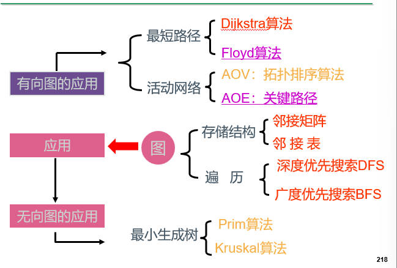
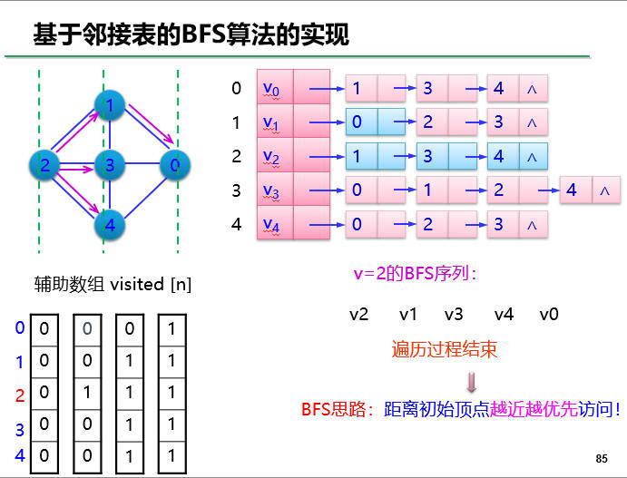
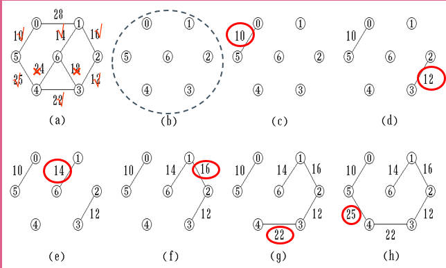

## 7.1图的定义和术语

数据结构中的图一般不重复出现一条边，如果允许重复边出现，这样的图称为多重图，如一个无向图中顶点1和2之间出现两条或两条以上的边。本书中讨论的图均指非多重图。

图：Graph=(V,E)

 V：顶点(数据元素)的有穷非空集合；

 E：边的有穷集合。

### 图的分类：

#### 边是否有方向

- 有向图

> G1=(V1，E1)
>
> V1={V1,V2,V3,V4}
>
> E1={ <V1,V2>，<V1,V3>，<V3,V4>，<V4,V1> }

- 无向图

> G2=(V2，E2)
>
> V2={V1,V2,V3,V4,V5}
>
> E2={ (V1,V2)，(V1,V4)，(V2,V3)，(V2,V5)，(V3,V4)，(V3,V5)，(V4,V5) }

#### 边上是否带权

- 非带权图
- 带权图（网络）
  - 无向网络
  - 有向网络

### 术语

**1.端点和邻接点：**

无向图：若存在一条边(i，j) ð 顶点i和顶点j为端点，它们互为邻接点。

有向图：若存在一条边<i，j> ð 顶点i为起始端点（简称为起点），顶点j为终止端点（简称终点)，它们互为邻接点。

邻接点：有边/弧相连的两个顶点之间的关系。

存在(vi, vj)，则称vi和vj互为邻接点；

存在<vi, vj>，则称vi邻接到vj， vj邻接于vi 

**2.关联（依附）**

边/弧与顶点之间的关系。

存在(vi, vj)/ <vi, vj>， 则称该边/弧关联于顶点vi和vj

**3.顶点v的度TD(v)、入度ID(v)、出度OD(v)**

无向图：以顶点 i 为端点的边数称为该顶点的度。 

有向图：以顶点i为终点的入边的数目，称为该顶点的入度。以顶点i为始点的出边的数目，称为该顶点的出度。一个顶点的入度与出度的和为该顶点的度。

思考：当有向图中仅1个顶点的入度为0,其余顶点的入度均为1，此时是何形状？是树，而且是有向树

若一个图(无向或有向)中有n个顶点和e条边，每个顶点的度为di（0≤i≤n-1），则有：e=d~i~的和/2(i=0,1,2,…n-1)

**4.完全图**

无向图：每两个顶点之间都存在着一条边，称为完全无向图， 包含有n(n-1)/2条边。

有向图：每两个顶点之间都存在着方向相反的两条边，称为完全有向图，包含有n(n-1)条边。

**5.稀疏图、稠密图**

当一个图接近完全图时，则称为稠密图。

相反，当一个图含有较少的边数（即当e<<n(n-1)）时，则称为稀疏图。

**6.子图**

设有两个图G=(V，E)和G'=(V'，E')，若V'是V的子集，且E'是E的子集，则称G'是G的子图。

**7.路径和路径长度**

路径：在一个图G=(V，E)中，从顶点i到顶点j的一条路径(i，i1，i2，…，im，j)。

所有的(ix，iy) ∈E(G)，或者<ix，iy> ∈E(G)

路径长度：指一条路径上经过的边的数目。

简单路径：若一条路径上除开始点和结束点可以相同外，其余顶点均不相同，则称此路径为简单路径。

**8.回路或环**

若一条路径上的开始点与结束点为同一个顶点，则此路径被称为回路或环。

开始点与结束点相同的简单路径被称为简单回路或简单环。

**9.连通、连通图和连通分量（无向图）**

连通：若从顶点i到顶点j有路径，则称顶点i和j是连通的。

连通图：若图中任意两个顶点都连通，则称为连通图，否则称为非连通图。

连通分量：无向图G中的极大连通子图称为G的连通分量。

极大连通子图：该子图是 G 连通子图，将G 的任何不在该子图中的顶点加入，子图不再连通。

**10.强连通图和强连通分量（有向图）**

连通：若从顶点i到顶点j有路径，则称从顶点i到j是连通的。

强连通图：若图G中的任意两个顶点i和j都连通，即从顶点i到j和从顶点j到i都存在路径，则称图G是强连通图。   

强连通分量：有向图G 的极大强连通子图

极大强连通子图：该子图是G的强连通子图，将D的任何不在该子图中的顶点加入，子图不再是强连通的。

（强连通图只有一个强连通分量，即本身。非强连通图有多个强连通分量。）

在一个非强连通中找强连通分量的方法：

1. 在图中找有向环
2. 扩展该有向环：如果某个顶点到该环中任一顶点有路径，并且该环中任意顶点到该顶点也有路径，则加入该顶点


**11.生成树和生成森林**

极小连通子图：该子图是G的连通子图，在该子图中删除任何一条边，子图不再连通

生成树：包含无向图G所有顶点的极小连通子图

生成森林：对非连通图，由各个连通分量的生成树的集合

**图的抽象数据类型描述**

```cpp
 ADT Graph
{  数据对象：
         D={ai | 1≤i≤n,n≥0,ai为ElemType类型}
   数据关系：
         R={<ai,aj>| ai,aj∈D,1≤i,j≤n,其中每个元素可以有零个或多个前驱元素，可以有零个或多个后继元素}
   基本运算：
  CreateGraph(&g)：创建图，有相关数据构造一个图g。
  DestroyGraph(&g)：销毁图，释放图g占用的存储空间。
  DispGraph(g):输出图，显示图g的顶点和边信息。
  DFS(g，v)：从顶点v出发深度优先遍历图g。
  BFS(g，v)：从顶点v出发广度优先遍历图g。
…
}
```


## 7.2图的存储结构

顺序存储：数组（邻接矩阵）

链式存储：多重链表（邻接表、邻接多重表、十字链表）

### 邻接矩阵

基本思想：

- 一维数组：存储图中顶点的信息
- 二维数组（邻接矩阵）：存储图中各顶点之间的邻接关系


 **无向图**

- 无向图的邻接矩阵的特点：对称矩阵
- 无向图求顶点v的度：第v行/第v列非零元素的个数
- 判断顶点i和j之间是否存在边：if(arc\[i][j] ==1 )
- 求顶点i的所有邻接点：扫描第i行，acr\[i][j]==1的顶点j则为顶点i的邻接点

无向网络的邻接矩阵定义：


**有向图**

- 有向图的邻接矩阵一定不对称吗？不对，反例：顶点间存在方向相反的弧
- 求顶点v的出度：第v行非零元素的个数
- 求顶点v的入度：第v列非零元素的个数

有向网络的邻接矩阵定义同无向网络相似

**邻接矩阵表示法优缺点**

优点：

- 一个图的邻接矩阵表示是唯一的
- 容易实现图的操作，如：求某顶点的度、判断顶点之间是否有边、找顶点的邻接点等等

缺点：

- n个顶点需要n*n个单元存储边;空间效率为O(n2)。 对稀疏图而言尤其浪费空间。特别适合于稠密图的存储。

**邻接矩阵存储类型定义**

```cpp
#define  INFINITY    32767
#define  MAXV    100
typedef char VerTexType;      //假设顶点的数据类型为字符型 
typedef int ArcType;           //假设边的权值类型为整型
typedef struct  		//图的定义
{    VertexType vexs[MAXV];	//存放顶点信息
     ArcType arc[MAXV][MAXV]; //邻接矩阵
     int vexnum，arcnum;  	//顶点数，边数
}  MGraph;
```

**采用邻接矩阵表示法创建无向网络**

算法思想

1. 输入总顶点数和总边数
2. 依次输入点的信息存入顶点表中
3. 初始化邻接矩阵，使每个权值初始化为极大值
4. 构造邻接矩阵

```cpp
void CreateUDN(MGraph &G) 
{    //采用邻接矩阵表示法，创建无向网G 
     VerTexType v1,v2;       ArcType   w;     
     cin>>G.vexnum>>G.arcnum; 	//输入总顶点数，总边数 
     for(i = 0; i<G.vexnum; ++i)    
           cin>>G.vexs[i];                        	//依次输入点的信息 
     for(i = 0; i<G.vexnum;++i) 	//初始化邻接矩阵，边的权值均置为极大值
          for(j = 0; j<G.vexnum;++j)   
           {     if(i==j) G.arc[i][j] = 0; else G.arc[i][j] =  INFINITY; }  
     for(k = 0; k<G.arcnum;++k) //构造邻接矩阵 
    {      cin>>v1>>v2>>w;         //输入一条边依附的顶点及权值 
           i = LocateVex(G, v1); 
           j = LocateVex(G, v2);          //确定v1和v2在G中的位置
          G.arc[i][j] = w;                   //边<v1, v2>的权值置为w 
          G.arc[j][i] = G.arc[i][j];    //置<v1, v2>的对称边<v2, v1>的权值为w 
   }//for 
}//CreateUDN 

int LocateVex(MGraph G,VertexType u)
 {//查找顶点u在图G顶点表中的序号，如果存在则返回u在顶点表中的下标;否则返回-1
   int i;
   for(i=0;i<G.vexnum;++i)
     if(u==G.vexs[i])
           return i;
   return -1;
 }

```

### 邻接表


**邻接表的优缺点**

优点：

- 空间效率为O(n+e)。邻接表多用于稀疏图
- 容易实现图的某些操作，如：求某顶点的度、找顶点的邻接点等
- 容易实现插入删除操作

缺点：

- 一个图的邻接表表示不是唯一的
- 判断两顶点间是否有边，需搜索结点对应的单链表，没有邻接矩阵方便

**邻接表存储类型定义**

```cpp
//声明边结点类型
typedef struct ArcNode
{     int    adjvex;		//该边的终点编号
      ArcNode *nextarc;   	//指向下一条边的指针
      int   weight;		//该边的权值等信息
}ArcNode;

//声明邻接表头结点类型
typedef struct VNode
{    VertexType     data;	            //顶点信息
     ArcNode   *firstarc;		//指向第一条边
} VNode;

//声明图邻接表类型
typedef struct 
{     VNode adjlist[MAXV] ;	//邻接表
       int vexnum, arcnum;	//图中顶点数n和边数e
} ALGraph;

```

**创建无向图的邻接表**

算法思想：

1. 输入总顶点数和总边数
2. 依次输入点的信息存入顶点表中，使每个表头结点的指针域初始化为NULL
3. 创建邻接表

```cpp
void  CreateUDG(ALGraph &G)
{ //创建无向图 G 的邻接表
　   VerTexType  v1,v2;     ArcNode * p1,*p2; int w;
      cin>>G.vexnum>>G.arcnum;       //输入总顶点数，总边数 
      for(int i = 0; i<G.vexnum; ++i)
      {//输入各点，构造表头结点表 
            cin>> G.adjlist[i].data;           	//输入顶点值 
            G.adjlist[i].firstarc=NULL;  //初始化表头结点的指针域为NULL 
       }//for 
      for(int k = 0; k<G.arcnum;++k) //输入各边，构造邻接表 
      {
           cin>>v1>>v2>>w;                //输入一条边依附的两个顶点 
           i = LocateVex(G, v1);  j = LocateVex(G, v2);    
           p1=(ArcNode*)malloc(sizeof(ArcNode));//生成一个新的边结点 
         p1->adjvex=j;    p1->weight = w;            	//邻接点序号为j 
         p1->nextarc= G.adjlist[i].firstarc;  G.adjlist[i].firstarc=p1;  
            //将新结点*p1插入顶点vi的边表头部 
           p2==(ArcNode*)malloc(sizeof(ArcNode)); //生成另一个对称的新的边结点 
         p2->adjvex=i; p2->weight = w;            	//邻接点序号为i 
         p2->nextarc= G.adjlist[j].firstarc;  G.adjlist[j].firstarc=p2;  
           //将新结点*p2插入顶点vj的边表头部 
     }//for 
}//CreateUDG 

```

### 有向图的十字链表表示法

十字链表（Orthogonal List）是有向图的另外一种链式存储结构，它是邻接表和逆邻接表的结合。

在十字链表中，对应于有向图中的每一条弧有一个结点，每个顶点也有一个结点，其结点结构如下所示：


```cpp
#define MAX_VERTEX_NUM 20
typedef struct ArcBox
{     int    tailvex,headvex;	//该弧的尾和头顶点的位置
      ArcBox *hlink,*tlink;   	//分别为弧头相同和弧尾相同的弧的链域
      InfoType   info;		//该弧相关信息（权值等）
}ArcBox;

typedef struct VexNode
{    VertexType     data;	            //顶点信息
     ArcBox   *firstin,*firstout;	//分别指向该顶点第一条入弧和出弧
} VexNode;

typedef struct 
{     VexNode xlist[MAX_VERTEX_NUM] ;	//表头向量
       int vexnum, arcnum;	// 有向图的当前顶点数和弧数
}OLGraph;

```

**十字链表特点**

- 建立十字链表的时间复杂度与建立邻接表相同（算法与建立邻接表算法类似）
- 容易找到以vi为尾的弧，也容易找到以vi为头的弧
- 容易求得顶点的出度和入度

### 无向图的邻接多重表表示法

邻接多重表（Adjacency MultiList是无向图的另外一种链式存储结构，每一条边用一个结点表示，每个顶点也用一个结点表示，与十字链表类似。


```cpp
#define MAX_VERTEX_NUM 20
typedef enum{unvisited,visited} VisitIf;
typedef struct EBox
{     VisitIf mark;            //访问标记
      int    ivex,jvex;	//该边依附的两个顶点的位置
      EBox *ilink,*jlink;   	//分别指向依附这两个顶点的下一条边
      InfoType   info;		//该边相关信息（权值等）
}EBox;
typedef struct VexBox
{    VertexType     data;	            //顶点信息
     EBox   *firstarc;	//指向第一条依附该顶点的边
} VexBox;
typedef struct 
{     VexBox adjmulist[MAX_VERTEX_NUM] ;	//表头向量
       int vexnum, arcnum;	// 无向图的当前顶点数和边数
}AMLGraph;

```


## 7.3图的遍历

定义：

从图中某一顶点出发，按照某种搜索方法沿着图的边访问（可以是对顶点的各种处理）图中的所有顶点，使每个顶点仅被访问一次，这个过程称为遍历。

*如果给定图是连通的无向图或者是强连通的有向图，则只需遍历一次就能访问图中所有顶点，否则需要多次调用图遍历算法。*

根据搜索方法的不同，图的遍历可以分为深度优先遍历（DFS）和广度优先遍历（BFS）

### 深度优先搜索( DFS ——Depth First Search)

DFS是一个递归的过程。

基本思想：——仿照树的先序遍历过程

1. 从图中某个顶点v出发，访问v
2. 依次从 v 的各个未被访问的邻接点出发进行深度优先遍历，直至图中所有和 v 有路径相通的顶点都被访问到
3. 如果此时图中尚有顶点未被访问，则另选图中一个未曾被访问的顶点做起始点，重复上述过程，直至图中所有顶点都被访问到为止

算法设计思路：

- 深度优先遍历的过程体现后进先出的特点：用栈和递归方式实现（用栈保存访问过的顶点）
- 图中可能存在回路，若要避免重复访问，可以设置辅助数组visited[n]，用来标记每个被访问过的顶点
  - 初始状态visited[i]=0
  - i被访问，改visited[i]=1，防止被多次访问

#### 基于邻接矩阵的DFS算法的实现


```cpp
void DFS(MGraph G, int v)
{      // 以顶点v为起点深度优先遍历图G，图G采用邻接矩阵存储 
  cout<<v;  visited[v] = 1;  		//访问第v个顶点
  for(int w = 0; w< G.vexnum; w++)  //依次检查邻接矩阵v所在的行  
        if((G.arc[v][w]!=0) && (!visited[w])) //w是v的邻接点，如果w未访问，则递归调用DFS 
            DFS(G, w);       
} 
```

#### 基于邻接表的DFS算法的实现


```cpp
void DFS(ALGraph G, int v)
{    //以顶点v为起点深度优先遍历图G，图G为邻接表类型 
  cout<<v;  visited[v] = 1;          //访问第v个顶点
  ArcNode *p= G.adjlist[v].firstarc; //p指向v的边链表的第一个边结点 
  while(p!=NULL) //边结点非空 
  {     w=p->adjvex;               	      //表示w是v的邻接点 
  if(!visited[w])  
       DFS(G, w); 	     //如果w未访问，则递归调用DFS 
  p=p->nextarc;                 //p指向下一个边结点 
 } 
} 

```


#### 非连通图的遍历

无向连通图：调用一次DFS，能够访问到图中的所有顶点。

无向非连通图：调用一次DFS，只能访问到初始点所在连通分量中的所有顶点，不可能访问到其他连通分量中的顶点。可以分别遍历每个连通分量，才能够访问到图中的所有顶点。

```cpp
void  DFSG(ALGraph G)
{　int i;
     for (i=0;i<G.vexnum;i++)     //遍历所有未访问过的顶点
          if (visited[i]==0) 
               DFS(G，i);
}
```

非连通图：调用DFS()的次数恰好等于连通分量的个数

#### DFS算法效率分析

- 用邻接矩阵来表示图，遍历图中每一个顶点都要从头扫描该顶点所在行，时间复杂度为O(n2)。
- 用邻接表来表示图，虽然有 2e 个表结点，但只需扫描 e 个结点即可完成遍历，加上访问 n个头结点的时间，时间复杂度为O(n+e)
- 稠密图适于在邻接矩阵上进行深度遍历
- 稀疏图适于在邻接表上进行深度遍历


### 广度优先搜索( BFS——Breadth First Search)

**基本思想**：——仿照树的层次遍历过程

1. 访问顶点 v
2. 依次访问 v 的各个未被访问的邻接点 v1 , v2 , …, vk
3. 分别从 v1 , v2 , …, vk 出发依次访问它们未被访问的邻接点，直至访问所有与顶点 v 有路径相通的顶点

*“先被访问顶点的邻接点”先于“后被访问顶点的邻接点”*

*广度优先搜索不是一个递归的过程，其算法也不是递归的。*

**算法设计思路**：

- 广度优先搜索遍历体现先进先出的特点，用队列实现（用队列保存访问过的顶点）
- 设置一个visited[]数组确定一个顶点是否访问过，visited[i]=0表示顶点i没有被访问，visited[i]=1表示顶点i已经被访问过

**BFS算法实现**

1. 从图中某个顶点v出发，访问v，并置visited[v]的值为1，然后将v进队
2. 只要队列不空，则重复下述处理
   - 队头顶点u出队
   - 依次检查u的所有邻接点w，如果visited[w]的值为0，则访问w，并置visited[w]的值为1，然后将w进队




```cpp
void BFS(ALGraph G，int v)
{        int w， i;
         ArcNode *p;
         SqQueue *qu;		//定义环形队列指针
         InitQueue(qu);		//初始化队列
         int visited[MAXV];            	//定义顶点访问标记数组
         for (i=0;i<G.vexnum;i++) 
	  visited[i]=0;	  	//访问标记数组初始化
         printf("%2d"，v); 		//输出被访问顶点的编号
         visited[v]=1;              	//置已访问标记
         enQueue(qu，v);
       while (!QueueEmpty(qu))       	//队不空循环
       {	deQueue(qu，w);		//出队一个顶点w
	p=G.adjlist[w].firstarc; 	//指向w的第一个邻接点
	while (p!=NULL)		//查找w的所有邻接点
	{     if (visited[p->adjvex]==0) 	//若当前邻接点未被访问
	       {	printf("%2d"，p->adjvex);  //访问该邻接点
		visited[p->adjvex]=1;	//置已访问标记
		enQueue(qu，p->adjvex);	//该顶点进队
           	       }
           	       p=p->nextarc;              	//找下一个邻接点
	}
       }
       printf("\n");
}

```

- 如果使用邻接矩阵，则BFS对于每一个被访问到的顶点，都要循环检测矩阵中的整整一行（ n 个元素），总的时间代价为O(n2)
- 用邻接表来表示图，虽然有 2e 个表结点，但只需扫描 e 个结点即可完成遍历，加上访问 n个头结点的时间，时间复杂度为O(n+e)

#### 非连通图的遍历

无向连通图：调用一次BFS，能够访问到图中的所有顶点。

无向非连通图：调用一次BFS，只能访问到初始点所在连通分量中的所有顶点，不可能访问到其他连通分量中的顶点。可以分别遍历每个连通分量，才能够访问到图中的所有顶点。

```cpp
void  BFSG(ALGraph G)
{      int i;
        for (i=0;i<G.vexnum;i++)     //遍历所有未访问过的顶点
             if (visited[i]==0) 
                  BFS(G，i);
}
```

非连通图：调用BFS()的次数恰好等于连通分量的个数

### DFS和BFS算法效率比较

- 空间复杂度相同，都是O(n)(借用了堆栈或队列）；
- 时间复杂度只与存储结构（邻接矩阵或邻接表）有关，而与搜索路径无关。

图的搜索算法设计->（转化）DFS或BFS算法求解

## 7.4图的连通性问题

思路：采用某种遍历方式来判断无向图G是否连通

>定义visited[]数组并置初值0，然后从某个顶点v开始遍历该图
>
>在一次遍历之后，若所有顶点的visited[]均为1，则该图是连通的；否则不连通

```cpp
int  visited[MAXV];
bool Connect(ALGraph G) 	//判断无向图G的连通性
{     int i;      
 		bool flag=true;
      for (i=0;i<G.vexnum;i++)		 //visited数组置初值
      {visited[i]=0;}
      DFS(G，0); 	//调用前面的中DSF算法，从顶点0开始深度优先遍历
      for (i=0;i<G.vexnum;i++)
            if (visited[i]==0)
           {     flag=false;	     break;           }
      return flag;
}
```


## 7.5有向无环图及其应用

### 生成树和最小生成树（MST）（保证连通的情况下，成本最小问题）

**生成树：**一个连通图的生成树是一个极小连通子图，它含有图中全部n个顶点和构成一棵树的n-1条边。

命题：如果在一棵生成树上添加一条边，必定构成一个环。

一个连通图的生成树不一定是唯一的。

由广度优先遍历得到的生成树称为**广度优先生成树**。

由深度优先遍历得到的生成树称为**深度优先生成树**。

**最小生成树（MST）：**对于带权连通图G，可能有多棵不同生成树，每棵生成树的所有边的权值之和可能不同，其中权值之和最小的生成树称为图的最小生成树或最小代价生成树。

**MST性质：**假设G=(V,E)是一个无向连通网络，U是V的一个非空子集，若（u,v）是一条具有最小权值的边，其中u∈U，v∈V-U，则必存在一棵包含边（u,v）的最小生成树。

#### Prim算法【归并顶点（加点法），与边数无关，适合稠密网】

**思想：**

1. 从某顶点 u0 出发，选择与它关联的具有最小权值的边(u0, v)，将其顶点加入到生成树的顶点集合U中
2. 每一步从一个顶点在U中，而另一个顶点不在U中的各条边中选择权值最小的边(u, v),把它的顶点加入到U中
3. 直到所有顶点都加入到生成树顶点集合U中为止

>（1）初始化U={u}。u到其他顶点的所有边为候选边；
>
>（2）重复以下步骤n-1次，使得其他n-1个顶点被加入到U中：
>
>​     Œ 从候选边中挑选权值最小的边输出，设该边在V-U中的顶点是k，将k加入U中；
>
>​      考察当前V-U中的所有顶点j，修改候选边：若(k，j)的权值小于原来和顶点j关联的候选边，则用(k，j)取代后者作为候选边。


**算法设计：**（解决4个问题）

1. 如何求U、V-U两个顶点集之间的最小边？（只求一条）
   - 只考虑V-U中的顶点j到U顶点集的边，从中找出最小代价边（k,j）设置辅助数组dis[]存储V-U中每个顶点到U的代价，其中dis[j]=w表示顶点j到U的代价为w。
2. 如何存储顶点j到U顶点集的最小边？
   - 设置辅助数组closest[]存储V-U中每个顶点到U的当前最小代价所对应的U中顶点的编号，其中closest[j]=k表示V-U中顶点j到U的最小边为（k,j）。
3. 一个顶点属于哪个集合？
   - 当一个顶点k加入U时，置dis[k]=0，dis[j]!=0表示顶点j在集合V-U中。
4. 图采用哪种存储结构更合适？
   - 邻接矩阵

```cpp
#define INF 32767		//INF表示∞
void  Prim(MGraph G，int u) //从初始顶点编号u开始构造图G的最小生成树
{     int dis[MAX_Vexnum], closest[MAX_Vexnum];
      int min ， i， j， k;
      for (i=0;i<G.vexnum;i++)		//给dis[]和closest[]置初值
      {	dis[i]=G.arc[u][i];
		closest[i]=u;
      }
       dis[u]=0; //标记u已经加入U
       for (i=1;i< G.vexnum;i++)	//输出(n-1)条边
       {	min=INF;
			for (j=0;j<G.vexnum;j++) //在(V-U)中找出离U最近的顶点k
	     if (dis[j]!=0 && dis[j]<min)
	     {	min=dis[j];
			k=j;		//k记录最近顶点编号
	     }
        printf(" 边(%d，%d)权为:%d\n"，closest[k]，k，min);
		dis[k]=0;		//标记k已经加入U
      	for (j=0;j<G.vexnum;j++) //修改数组dis和closest
            if (dis[j]!=0 && G.arc[k][j]<dis[j])//只考虑V-U中的顶点
            {	dis[j]=G.arc[k][j];
            closest[j]=k;
            }
     	}
}

```

局部最优+调整=全局最优

时间复杂度：O(n2)

#### Kruskal算法【归并法（加边法），适合稀疏网】

按权值递增次序选择合适的边来构造最小生成树的方法。

**思路：**

1. 构造一个只有 n个顶点，没有边的非连通图 T = { V, E },每个顶点自成一个连通分量
2. 在 E 中选最小权值的边,若该边的两个顶点落在不同的连通分量上，则加入 T 中；否则舍去，重新选择
3. 重复下去，直到所有顶点在同一连通分量上为止。

>   （1）置U的初值等于V（即包含有G中的全部顶点），最小生成树的边集TE的初值为空集。
>
>   （2）按边的权值从小到大的顺序依次从图G中选取边：
>
>​      Œ 若选取的边未使生成树T形成回路，则加入TE；
>
>​       否则舍弃，直到TE中包含(n-1)条边为止。



**算法设计：**（解决3个问题）

1. 图采用哪种存储结构更合适？
   - 邻接矩阵
2. 边的排序问题？
   - 采用堆排序算法
3. 如何解决加入一条边后是否出现回路？
   - 并查集

时间复杂度为O(elog2e)

**算法关键**：判断选择的边是否与生成树中已有边形成回路

设置一个辅助数组Vexset [0..n-1]，其元素Vexset [i]代表顶点i所属的连通分量的编号（同一个连通分量中所有顶点Vexset值相同）。

>初始时T中只有n个顶点，没有任何边，每个顶点i看成一个连通分量，该连通分量的编号就是i，即Vexset[i]=i。
>
>将图中所有边按权值递增排序，从前向后选边（保证总是选择权值最小的边），当选择一条边（u1，v1)，求出这两个顶点所属连通分量的编号分别为sn1和sn2：
>
>>若sn1=sn2，说明顶点u1和v1属于同一个连通分量 ->不能添加该边
>>
>>若sn1≠sn2，说明顶点u1和v1属于不同连通分量 ->添加该边。添加后原来的两个连通分量需要合并，即将两个连通分量中所有顶点的Vexset值改为相同（改为sn1或者sn2均可)。

从图G的邻接矩阵中获取所有边集数组arc:

```cpp
#define MaxV 100                       	//最大顶点数
//定义辅助数组Edge
struct {
	VertexType Head;		//边的始点
	VertexType Tail;		//边的终点
	Arctype w;		//边上的权值
}Edge[(MaxV*(MaxV-1))/2];

int Vexset[Max_Vexnum];//辅助数组Vexset定义各顶点属于的连通分量编号

```

>由于是无向图，将邻接矩阵上三角部分的所有边存放在 Edge[]中，每一条边对应的列表为 (Head,Tail,w)，其中Head、Tail分别为边的头尾顶点编号，w为边的权值。
>
>对Edge[]按权值w递增排序后做上述操作。

```cpp
void MiniSpanTree_Kruskal(MGraph G) 
{ //无向网G以邻接矩阵形式存储，构造G的最小生成树T，输出T的各条边     
    int i , j , v1 , v2 , vs1 , vs2;
    Sort(Edge);   	//将数组Edge中的元素按权值从小到大排序 
    for(i = 0; i < G.vexnum; ++i)     //辅助数组，表示各顶点自成一个连通分量 
        Vexset[i] = i;
    for(i = 0; i < G.arcnum; ++i) 
    {//依次查看排好序的数组Edge中的边是否在同一连通分量上     
        v1 =LocateVex(G, Edge[i].Head);     	//v1为边的始点Head的下标 
        v2 =LocateVex(G, Edge[i].Tail);     	//v2为边的终点Tail的下标 
        vs1 = Vexset[v1];       	//获取边Edge[i]的始点所在的连通分量vs1 
        vs2 = Vexset[v2];       	//获取边Edge[i]的终点所在的连通分量vs2 
        if(vs1 != vs2) //边的两个顶点分属不同的连通分量 
        {    cout << Edge[i].Head << "-->" << Edge[i].Tail << endl;//输出此边 
	for(j = 0; j < G.vexnum; ++j) //合并vs1和vs2两个分量，即两个集合统一编号 
	     if(Vexset[j] == vs2) Vexset[j] = vs1; //集合编号为vs2的都改为vs1 
        }//if 
    }//for 
}//MiniSpanTree_Kruskal

void main()
{
	MGraph G;
	CreateUDN(G);
	
	cout <<endl;
	cout << "*****无向网G创建完成！*****" << endl;

	cout <<endl;
	MiniSpanTree_Kruskal(G);
}///main

```

**总结**

>Prim算法
>
>起点v
>
>所有顶点分为U和V-U
>
>每次选择这两个集合之间的最小边

>Kruskal算法
>
>将边按权值递增排列
>
>每次选择权值小并且不构成回路的边
>
>O(elog2e)

### 有向无环图及其应用

#### AOV网与拓扑排序

**拓扑排序的概念**

设G=(V, E)是一个具有n个顶点的有向图，V中顶点序列v1, v2, …, vn称为一个拓扑序列，当且仅当该顶点序列满足：若<i, j>是图中的边，则在拓扑序列中顶点i必须在顶点j之前。在一个有向图中找一个拓扑序列的过程称为拓扑排序。


**拓扑排序算法思想（重复选择入度为0的顶点）：**

找入度为0的顶点->输出该顶点，删除从它出发的边->重复该步骤，直到剩余的图中不再存在入度为0的顶点为止

若成功，则产生所有顶点的拓扑序列

若不成功，则不能产生所有顶点的拓扑序列，这时AOV网中必定存在有向环

1. 输入AOV网，令n为顶点个数
2. 求所有顶点的入度值，将所有入度为0的顶点入栈
3. 栈不空，出栈一个顶点i，并输出i
4. 将i的所有邻接点入度减1，如果入度减为0，则入栈
5. 重复3、4步，直到栈空为止

```cpp
typedef struct 	       	//表头结点类型
{     VertexType data;         	//顶点信息
       int count;           	//存放顶点入度//用于找入度为0的顶点
      ArcNode *firstarc;   	//指向第一条边
} VNode;
```

```cpp
void TopSort(ALGraph G)	//拓扑排序算法
{      int i，j;   
 		ArcNode *p;
        SqStack *st;	
 		InitStack(st);
        for (i=0;i<G.vexnum;i++)		//入度置初值0
			G.adjlist[i].count=0;
        for (i=0;i<G.vexnum;i++)		//求所有顶点的入度
        {	p=G.adjlist[i].firstarc;
            while (p!=NULL)
            {        G.adjlist[p->adjvex].count++;
                      p=p->nextarc;
            }
       }
         for (i=0;i<G.vexnum;i++)		//将入度为0的顶点进栈
	 			if (G.adjlist[i].count==0) 	Push(st,i);
         while (!EmptyStack(st))		//栈不空循环排序
         {	  Pop(st,i)			//出栈一个顶点i
              printf("%d ",i);		//输出该顶点
              p=G.adjlist[i].firstarc;		//找第一个邻接点
              while (p!=NULL)		//将顶点i的出边邻接点的入度减1
              {      j=p->adjvex;	        
               		G.adjlist[j].count--;
                     if (G.adjlist[j].count==0)	//将入度为0的邻接点进栈
                             Push(st,j); 
                     p=p->nextarc;		//找下一个邻接点
            }
       }
}

```

#### AOE网与关键路径

**1.AOE网的概念：**


**2.关键路径：**从AOE网中源点到汇点的最长路径，具有最大长度的路径叫关键路径

关键路径由关键活动构成，关键路径可能不唯一

**3.求关键路径的过程**

（1）事件的最早开始时间ve和最迟开始时间vl


(2)活动的最早开始时间e和最迟开始时间l

活动a的最早开始时间e(a)指该活动起点x事件的最早开始时间，即：e(a)=ve(x)

活动a的最迟开始时间l(a)指该活动终点y事件的最迟开始时间与该活动所需时间之差，即：l(a)=vl(y)-c

(3)求关键活动

对于每个活动a，求出d(a)=l(a)-e(a)，若d(a)=0，则称活动a为关键活动。

对关键活动来说，不存在富余时间，最早开始时间=最迟开始时间

**注意：**缩短关键活动所需的时间并不一定能缩短整个工程的工期。

但是拖延关键活动的时间则一定会拖延整个工期。

**求事件结点的最早发生时间(利用拓扑排序算法)**

>1、设每个结点的最早发生时间为0，将入度为零的结点进栈。
>
>2、将栈中入度为零的结点V取出，并压入另一栈，用于形成逆向拓扑排序的序列。
>
>3、根据邻接表找到结点V的所有的邻接结点，将结点V的最早发生时间 + 活动的权值 得到的和同邻接结点的原最早发生时间进行比较；如果该值大，则用该值取代原最早发生时间。另外，将这些邻接结点的入度减1。如果某一结点的入度变为零，则进栈。
>
>4、反复执行 2、3；直至栈空为止。

```cpp
Status  Topologicalsort（ ALGraph G,  SqStack &T）
//  栈 T中存储的是拓扑逆序，为求事件的最迟发生时间的时候用。
{  FindinDegree（G，indegree）;       // 对各顶点求入度，建立入度为零的栈 S
   Initstack（T）；count = 0;     ve [ 0 .. G.vexnum - 1 ] = 0;
   while （！StackEmpty（S））
   {       Pop（S，j）;Push（T，j）; ++count;
           for （p=G.vertices[i]. firstarc; p; p=p->nextarc）
           {     k = p->adjnexr;
	   if （!（- - indegree [ k ]）） Push（S, k）;
	   if （ve[ j ]+ *（ p->info）> ve[  k ] ）     ve[ k ]  = ve[ j ] +  *（ p->info）; }
           }
    }
    if （count < G.vexnum）return ERROR;
    else return OK;
}
```

**求事件结点的最迟发生时间(利用逆向拓扑排序算法)**

>1、设每个结点的最迟发生时间为汇点的最早发生时间。
>
>2、将栈中的结点V取出。
>
>3、根据逆邻接表找到结点V的所有的起始结点，将结点V的最迟发生时间 - 活动的权值得到的差同起始结点的原最迟发生时间进行比较；如果该值小，则用该值取代原最迟发生时间。
>
>4、反复执行 2、3；直至栈空为止。

## 7.6最短路径

**不带权图**

最短路径：从一顶点到另一顶点可能存在着多条路径，每条路径上所经过的边数可能不同，即路径长度不同，把路径长度最短（即经过的边数最少)的那条路径叫做最短路径，其路径长度称为最短路径长度或最短距离。

适合采用BFS求最短路径

**带权图**

带权路径长度：把一条路径上所经边的权值之和定义为该路径的路径长度或称带权路径长度。

从源点到终点可能不止一条路径，把带权路径长度最短的那条路径称为最短路径，其路径长度（权值之和)称为最短路径长度或者最短距离。

不适合采用BFS求最短路径

**最短路径问题应用**

典型用途：交通问题。如：城市A到城市B有多条线路，但每条线路的交通费（或所需时间）不同，那么，如何选择一条线路，使总费用（或总时间）最少？

问题抽象：在带权有向图中A点（源点）到达B点（终点）的多条路径中，寻找一条各边权值之和最小的路径，即最短路径。

**注**：最短路径与最小生成树不同，路径上不一定包含n个顶点

### Dijkstra算法（一顶点到其他顶点的最短路径）

**大致思路：**

>设G=(V，E)是一个带权有向图：    
>
>图G中的顶点集合V划分为两部分： 集合𝑺和𝑽 - 𝑺
>
>•其中𝑺是已求出最短路径的顶点集合， 其最短路径已经确定；
>
>•而𝑽 - 𝑺是未加入S的顶点集合， 其最短路径待定。
>
>每一步求出v到U中一个顶点u的最短路径，并将u移动到S中。直到U为空。

（1）初始化：S只包含源点即S={v}，v的最短路径为0。U包含除v外的其他顶点， v到U中顶点i的距离为边上的权值（若v与i有边< v ，i>）或∞（若i不是v的出边邻接点）。  

（2）从U中选择一个距离v最小的顶点u，把u加入S中（该选定的距离就是v ->u的最短路径长度）。   

（3）以u为新考虑的中间点，修正更新v到U中各顶点j的最短路径长度：若从源点v到顶点j（j∈U）的最短路径长度（经过顶点u）比原来最短路径长度（不经过顶点u）短，则修改顶点j的最短路径长度。 

（4）重复步骤（2）和（3）直到所有顶点都包含在S中。 (考虑中间其他所有顶点k，通过比较得到 v -> j 的最短路径)

**算法设计要点：**

- 判断顶点i属于哪个集合，设置一个数组S，S[i]=1表示顶点i属于S集合，S[i]=0表示顶点i属于U集合。
- 保存最短路径长度，由于源点v是已知的，只需要设置一个数组D[0..n-1]，D[i]用来保存从源点v到顶点i的最短路径长度。D[i]的初值为<v，i>边上的权值，若顶点v到顶点i没有边，则权值定为∞。以后每考虑一个新的中间点u时，D[i]的值可能被修改变小。
- 保存最短路径，设置一个数组P[0..n-1]，其中P[i]存放从源点v到顶点i的最短路径。


- 按顶点进入S的先后顺序，最短路径长度越来越长
- 一个顶点一旦进入S后，其最短路径长度不再改变（调整）

**算法思想：**

> ① 初始化：
>
> ​	Ø将源点v加到S中，即S[v] = true；
>
> ​	Ø将v到各个终点的最短路径长度初始化为权值，即D[i] = G.arc\[v][vi]，(vi∈V − S)；
>
> ​	Ø如果v和顶点vi之间有弧，则将vi的前驱置为v，即P[i] = v，否则P[i] = −1。
>
> ② 选择下一条最短路径的终点vk，使得：
>
>  	D[k] = Min{ D[i] | vi∈V − S }
>
> ③ 将vk加到S中，即S[vk] = true。
>
> ④ 更新从v出发到集合V−S上任一顶点i的最短路径的长度，同时更改vi的前驱为vk。
>
>  	 若S[i]=false 且 D[k]+G.arc\[k][i]<D[i]，则
>
> ​		D[i]=D[k]+ G.arc\[k][i]; 
>
>   	  P [i]=k;。 
>
> ⑤ 重复②～④ n − 1次，即可按照路径长度的递增顺序，逐个求得从v到图上其余各顶点的最短路径，直到S==V。

```cpp
void Dijkstra(MGraph G，int v)
{     int D[MAX_Vexnum]，P[MAX_Vexnum];
      bool S[MAX_Vexnum];
      int mindis,i,j,u;
     //D和P数组初始化
 	for (i=0; i < G.vexnum; i++)
      {       D[i] = G.arc[v][i];	//距离初始化
            S[i] = false;		//S[]置false
            if (G.arc[v][i] < INF)	//路径初始化
                   P[i] = v;		//顶点v到i有边时
            else
                  P[i] = -1;		//顶点v到i没边时
      }
      S[v] = true;	 		//源点v放入S中
      D[v] = 0;                      	//源点到源点的距离为0
       for (i=0; i < G.vexnum; i++)	 	//循环n-1次
       {   //找最小路径长度顶点u   
           mindis = INF;
			for (j=0; j < G.vexnum; j++)
                 if (S[j]==false && D[j] < mindis) 
                 {        u=j;
                mindis=D[j];
                 }
            S[u] = true;			//顶点u加入S中
            //调整
            for (j=0; j < G.vexnum; j++)	//修改v0到不在S中的顶点的距离
                 if (S[j] == 0 )
                      if (G.arc[u][j] < INF && D[u]+G.arc[u][j] < D[j])
                      {      D[j] = D[u] + G.arc[u][j];
                   P[j] = u;
                      }
      }
      DisPath(D,P,S,G.vexnum,v);	//回溯，输出最短路径
}

```

时间复杂度为O(n2)。

### Floyd算法（任意两点间的最短路径）

**问题描述：**对于一个各边权值均大于零的有向图，对每一对顶点i≠j，求出顶点i与顶点j之间的最短路径和最短路径长度。    

**算法：递推思路（dp）**


**算法设计：**(解决2个问题)

(1)用二维数组D存储最短路径长度：

- Dk\[i][j]表示考虑顶点0~k后得出的i -> j的最短路径长度。
- Dn-1\[i][j]表示最终的i -> j的最短路径长度

(2)用二维数组P存放最短路径：

- Pk\[i][j]表示考虑顶点0~k后得出的i -> j的最短路径。
- Pn-1\[i][j]表示最终i -> j的最短路径。


```cpp
void Floyd(MGraph G)		//求每对顶点之间的最短路径
{     int D[MAX_Vexnum][MAX_Vexnum];	//建立D数组
      int P[MAX_Vexnum][MAX_Vexnum];	//建立P数组
　  int i, j, k;
　  for (i=0;i<G.vexnum;i++)   		
         for (j=0;j<G.vexnum;j++) 
         {       D[i][j]=G.arc[i][j];
             if (i!=j && G.arc[i][j]<INF)
                      P[i][j]=i; 	//i和j顶点之间有一条边时
             else			 //i和j顶点之间没有一条边时
                      P[i][j]=-1;
     	}
 　for (k=0;k<G.vexnum;k++)		//求Dk[i][j]
　{     for (i=0;i<G.vexnum;i++)
           for (j=0;j<G.vexnum;j++)
                if (D[i][j]>D[i][k]+D[k][j])	//找到更短路径
                {　   D[i][j]=D[i][k]+D[k][j];	//修改路径长度
                         P[i][j]=P[k][j]; 	//修改最短路径为经过顶点k
                }
　  }
}	
```


