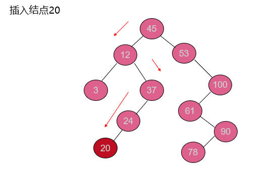
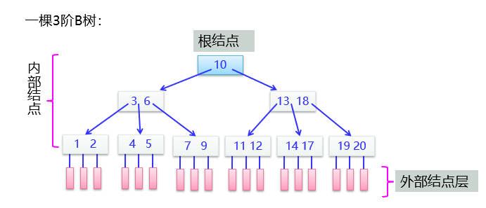

## 9.1 查找的基本概念

**查找表**：一般情况下，被查找的对象称为查找表，查找表包含一组元素（或记录），每个元素由若干个数据项组成，并假设有能唯一标识元素的数据项，称为主关键字（默认按主关键字查找)。

**查找**：给定一个值k，在含有n个元素的查找表中找出关键字等于k的元素。若找到这样的元素，表示查找成功，返回该元素的信息或该元素在表中的位置；否则查找不成功或者查找失败，返回相应的指示信息。

**内查找**：整个查找都在内存进行

**外查找**：查找过程中需要访问外存

查找表按照操作方式分为静态查找表和动态查找表两类。

**静态查找表**：是只作查找操作的查找表，主要操作有查询某个“特定的”数据元素是否在查找表中，检索某个“特定的”数据元素及其属性。

**动态查找表**：在查找过程中同时插入查找表中不存在的数据元素，或者从查找表中删除已存在的某个数据元素。

>线性表的查找
>
>（1）顺序查找
>
>（2） 二分查找
>
>（3）分块查找
>
>树表的查找
>
>（1）二叉搜索树查找
>
>（2） B树查找
>
>哈希表的查找

**查找方法的性能指标**：平均查找长度ASL


成功情况下的平均查找长度指在查找表中找到指定关键字*k*的元素平均所需关键字比较的次数。

不成功情况下的平均查找长度指在查找表中确定找不到关键字*k*的元素平均所需关键字比较的次数。

## 9.2 静态查找表的查找

线性表有顺序和链式两种存储结构。这里介绍以顺序表作为存储结构时实现线性表的查找算法。定义被查找的顺序表类型定义如下：

```cpp
#define MAXSIZE  <表中最多记录个数>
typedef struct 
{      KeyType key; 	  	//KeyType为关键字的数据类型
       InfoType data;  		//其他数据项
}  ElemType;			//查找顺序表元素类型
typedef struct 
{
     ElemType   *R; //表
     int          length;     //表长
}SqList;
```

### 顺序查找

**数据特点**：数据表中的数据元素无序

**查找方法**：从表的一端开始，顺序扫描线性表，依次将扫描到的关键字和给定值k相比较(假设元素从下标1开始存起)：若当前扫描到的关键字与k相等，则查找成功，返回i；若扫描结束后，仍未找到关键字等于k的记录，则查找失败，返回0。

改进：把待查关键字key存入表头（“监视哨”），从后向前逐个比较，可免去查找过程中每一步都要检测是否查找完毕，加快速度。

```cpp
int SeqSearch(SqList L,KeyType k)
{     int i=L.length;  
      L.R[0].key=k;
      while (L.R[i].key!=k)	 //从表尾往前找	       
            i--;
      return i;	
}
```


>顺序查找的特点?
>
>优点：算法简单，对表结构无任何要求（顺序和链式均适用）
>
>缺点： n很大时查找效率较低
>
>改进措施：非等概率查找时，可按照查找概率进行排序
>
>适用情况：当数据无序时

### 二分查找（折半查找）

思路：

- 若k==R[mid].key，查找成功
- 若k<R[mid].key，则high=mid-1
- 若k>R[mid].key，则low=mid+1

**非递归算法**：

>设表长为n，low、high和mid分别指向待查元素所在区间的上界、下界和中点，k为给定值
>
>初始时，令low=0, high=n-1, mid= (low+high)/2
>
>让k与mid指向的记录比较
>
>>Ø若k==L.R[mid].key，查找成功
>>
>>Ø若k<L.R[mid].key，则high=mid-1
>>
>>Ø若k>L.R[mid].key，则low=mid+1
>
>重复上述操作，直至low>high时，查找失败

```cpp
int Search_Bin( SqList L , KeyType key )
{	//若找到，则函数值为该元素在表中的逻辑序号，否则为0
     int low=0 , high=L.length-1 , mid;
     while(low<=high)
     {
          mid=( low + high )/2;
          if( key == L.R[mid].key) 
                 return mid; 
           else if( key < L.R[mid].key) 
                 high=mid-1;           //修改上界
           else    low=mid+1;      //修改下界
      }	
      return -1;		//表中不存在待查元素
}										 
```

**递归算法**：

```cpp
int Search_Bin (SqList L, keyType key, int low, int high) 
{     int mid=(low+high)/2; 
      if(low<=high)
      {
            if(key == L.R[mid].key)  return mid; 
            else if( key < L.R[mid].key)  
                   return Search_Bin (L, key, low, mid-1);
             else   
                  return Search_Bin (L, key, mid+1,high);
       }
       else
             return -1;   //查找不到时返回-1
}
```


二分查找的时间复杂度是O(log2n)

适用条件：采用顺序存储结构的有序表，不宜使用链式结构

采用二分查找，成功时最大的比较次数是log2(n+1)向上取整

### 索引存储结构和分块查找

#### 索引存储结构


按关键字k的查找过程：

- 先在索引表按折半查找方法找到关键字为k的索引项，得到其地址，所花时间为O(log2n)。
- 再通过地址在数据表中找到对应的元素，所花时间为O(1)，合起来的查找时间为O(log2n)。

#### 分块查找（块间有序，块内无序）

块间有序：分成若干子表，要求每个子表中的数值都比后一块中数值小（但子表内部未必有序）。

将各子表中的最大关键字构成一个索引表，索引表中包含每个子表的起始地址（即头指针）。


只有分块查找需要进行两次查找。

>优点：插入和删除比较容易，无需进行大量移动。
>
>缺点：要增加一个索引表的存储空间并对初始索引表进行排序运算。
>
>适用情况：如果线性表既要快速查找又经常动态变化，则可采用分块查找。

## 9.3 动态查找表的查找（树表）

**树表**：以二叉树或树作为表的组织形式，称为树表，它是一类动态查找表，不仅适合于数据查找，也适合于表插入和删除操作。

### 二叉排序树（BST）

**定义**：二叉排序树（简称BST）又称二叉查找（搜索）树，其定义为：二叉排序树或者是空树，或者是满足如下性质的二叉树：（结点值约束）

>若它的左子树非空，则左子树上所有结点值（默认为结点关键字)均小于根结点值。
>
>若它的右子树非空，则右子树上所有结点值均大于根结点值。
>
>左、右子树本身又各是一棵二叉排序树。

注意：二叉排序树中没有相同关键字的结点

二叉排序树特点：

- 二叉排序树的中序序列是一个递增有序序列
- 根结点的最左下结点是关键字最小的结点
- 根结点的最右下结点是关键字最大的结点

```cpp
//二叉排序树结点类型定义
typedef struct node 
{       KeyType key;            	  //关键字项
　    InfoType data;          	  //其他数据域
        struct node *lchild，*rchild; 	  //左右孩子指针
}  BSTNode;
```

#### BST的查找

**算法思想:**

（1）若二叉排序树为空，则查找失败，返回空指针。

（2）若二叉排序树非空，将给定值key与根结点的关键字T->key进行比较：

- 若key等于T->key，则查找成功，返回根结点地址；
- 若key小于T->key，则进一步查找左子树；
- 若key大于T->key，则进一步查找右子树。

递归查找算法SearchBST()如下（在二叉排序树bt上查找关键字为k的记录，成功时返回该结点指针，否则返回NULL）：

```cpp
BSTNode *SearchBST(BSTNode *bt，KeyType k)
{ 
      if (bt==NULL || bt->key==k) 	            //递归出口
            return bt;
      if (k<bt->key)
    　   return SearchBST(bt->lchild，k);   //在左子树中递归查找
      else
    　   return SearchBST(bt->rchild，k);   //在右子树中递归查找
}
```

**二叉排序树的查找性能分析**：

平均查找长度和二叉树的形态有关，即，

- 最好：log2n（形态匀称，与二分查找的判定树相似）
- 最坏: （n+1)/2（单支树）

> 给定含n个关键字的关键字序列构造一棵二叉排序树。其中查找性能最好的是高度最小的二叉排序树，最好查找性能为O(log2n)。查找性能最坏的是高度为n的二叉排序树（单支树），最坏查找性能为O(n)。平均情况由具体的关键字序列来确定。
>
> 二叉排序树的时间复杂度在O(log2n)和O(n)之间

#### BST的插入和生成

在根结点p的二叉排序树中插入关键字为k的结点的过程如下：

- 若p为空，创建一个key为k的结点，返回将它作为根结点。
- 若k<p.key，将k插入p结点的左子树中并且修改p的左子树。
- 若k>p.key，将k插入p结点的右子树中并且修改p的右子树。
- 其他情况是k=p.key，说明树中已有关键字k，修改data值并返回p。

注意：插入的元素一定在叶结点上



从空树出发，经过一系列的查找、插入操作之后，可生成一棵二叉排序树


不同插入次序的序列生成不同形态的二叉排序树

```cpp
//插入
int InsertBST(BSTNode *&p，KeyType k)	
{    if (p==NULL)	 //原树为空， 新插入的记录为根结点
     {     p=(BSTNode *)malloc(sizeof(BSTNode));
            p->key=k;p->lchild=p->rchild=NULL;
            return 1;
      }
      else if  (k==p->key) 	//存在相同关键字的结点，返回0
           return 0;
      else if (k<p->key) 
          return InsertBST(p->lchild，k);　	//插入到左子树中
      else  
          return InsertBST(p->rchild，k);  	//插入到右子树中
 }//先序遍历的思想
```

```cpp
//生成
BSTNode *CreatBST(KeyType A[]，int n) //返回树根指针
{      BSTNode *bt=NULL;    //初始时bt为空树
       int i=0;
       while (i<n) 
       {    InsertBST(bt，A[i]);  //将A[i]插入二叉排序树T中
　　     i++;
       }
       return bt;       	    //返回建立的二叉排序树的根指针
} 
```

#### BST的结点删除

（1）被删除的结点是叶子结点：直接删去该结点，其双亲结点中相应指针域的值改为“空”

（2）若结点p只有左孩子没有右孩子（结点p的度为1），根据二叉排序树的特点，可以用结点p的左子树替代结点p的子树，也就是直接用其左孩子替代它（结点替代）。

（3）若结点p只有右孩子没有左孩子（结点p的度为1），根据二叉排序树的特点，可以用结点p的右子树替代结点p的子树，也就是直接用其右孩子替代它（结点替代）。

（4）若结点p既有左孩子又有右孩子（结点p的度为2），根据二叉排序树的特点，可以从其左子树中选择关键字最大的结点（中序前驱）或从其右子树中选择关键字最小的结点（中序后继）q替代结点p，再将结点q从相应子树中删除。操作步骤是先用结点q的值替代结点p的值（值替代），再删除结点q。


### 平衡二叉树（AVL）

**定义**：若一棵二叉树中每个结点的左、右子树的高度至多相差1，则称此二叉树为平衡二叉树（AVL）。　

**平衡因子**：该结点左子树的高度减去右子树的高度。

#### AVL的插入调整

**LL平衡旋转**


**RR平衡旋转**


**LR平衡旋转**


**RL平衡旋转**


#### AVL的查找

在平衡二叉树上进行查找的过程和在二叉排序树上进行查找的过程完全相同，因此在平衡二叉树上进行查找关键字的比较次数不会超过平衡二叉树的高度。

含有n个结点的平衡二叉树的平均查找长度为O(log2n)。

### 小结


### B树

**定义**：B树和B+树是一种平衡的多路查找树（平衡多叉树），是一种用作外查找的数据结构，其中的数据存放在外存中。一般用于文件的索引结构，如磁盘管理系统中的目录管理以及数据库系统中的索引组织。

**B树的阶**：树中所有结点的度的最大值称为B树的阶，通常用m表示，从查找效率考虑，一般要求m≥3。



3阶B树上所有非终端结点至多可有3棵子树，至少有2棵子树（即子树个数为2或3，故又称2-3树）

说明：一棵B树中总有n个关键字，则外部结点个数为n+1。

**一棵m阶的B树**或者是一棵空树，或者是满足下列要求的m叉树：

1. 树中每个结点至多有m棵子树；

2. 若根结点不是叶子结点，则根结点至少有两棵子树；

3. 除根之外的所有非终端结点至少有m/2向上取整棵子树；

4. 所有的叶子结点都出现在同一层，并且不带信息，通常称为外部结点或失败结点（失败结点并不存在，指向这些结点的指针为空。引入失败结点是为了便于分析B树的查找性能。计算树高时计入该层）。

5. 每个结点的结构如下，结点中按关键字大小顺序排列：

   |   n   |  p0   |  k1   |  p1   |  k2   |  p2   |   …   |  kn   |  pn   |
   | :---: | :---: | :---: | :---: | :---: | :---: | :---: | :---: | :---: |

   B树是所有结点的平衡因子均等于0的多路查找树，具有平衡、有序、多路的特点

```cpp
//B树的结点类型定义
#define MAXM 10		//定义B树的最大的阶数
typedef   int KeyType;       	//KeyType为关键字类型
typedef struct node 
{      int keynum; 	         	 //结点当前拥有的关键字的个数
       KeyType key[MAXM];      	//[1..keynum]存放关键字
       struct node *parent;	   	//双亲结点指针
       struct node *ptr[MAXM]; 	//孩子结点指针数组[0..keynum]
}  BTNode;
```

#### B树的查找

将k与根结点中的key[i]进行比较：

1. 若k=key[i]，则查找成功；
2. 若k<key[1]，则沿着指针p[0]所指的子树继续查找；
3. 若key[i]<k<key[i+1]，则沿着指针p[i]所指的子树继续查找；
4. 若k>key[n]，则沿着指针p[n]所指的子树继续查找。


#### B树的插入

先计算最多关键字个数MAX=m-1，多于m-1个关键字，则进行分裂

（1）查找该关键字的插入结点

（2）插入关键字

注意：与二叉排序树的插入不同，为了满足B树的定义，不是在树中添加一个叶子结点，而是首先在最低层的某个非终端结点中添加一个关键字


#### B树的删除

先计算非根结点的关键字最少个数MIN=m/2向上取整-1

(1)查找关键字k所在的结点

(2)删除关键字k

**删除关键字k分两种情况**：

(1)在非底层上删除关键字k

将要删除记录用其右（左）邻近指针指向的子树中关键字最小（大）的记录替换，在将该右（左）邻近指针指向的子树中关键字最小（大）的记录删除

(2)在底层上删除关键字k

删除记录后，结点的关键字个数如果小于MIN，则要进行“合并”结点的操作


B树的平衡因子均等于0


### B+树

 B+树是一种B树的一种变形树。更适合于索引文件的组织。象数据库管理系统中的数据库文件索引大多采用B+树组织。

**一棵m阶B+树满足下列要求（1，2，3与B树相同）**：　　

1. 每个分支结点至多有m棵子树
2. 根结点或者没有子树，或者至少有两棵子树
3. 除根结点外，其他每个分支结点至少有m/2向上取整棵子树
4. 有n棵子树的结点恰好有n个关键字
5. 所有叶子结点包含全部关键字及指向相应记录的指针，而且叶子结点按关键字大小顺序链接，并将所有叶子结点链接起来
6. 所有分支结点可以看成是索引部分，结点中仅包含其子树中的最大关键字及指向子树的指针


#### B+树的查找

在B+树上进行随机查找、插入和删除的过程基本上与B树类似。

查找过程

-    B+树有两个头指针，一个指向树根(树索引)，一个指向关键字最小的叶结点(顺序链)。
-    一种是从最小关键字起顺序查找，另一种是从根结点开始，进行随机查找。
-    与B树不同的是，若非终端结点上的关键字等于给定值，并不终止，而是继续向下直到叶子结点。因此，不管查找成功与否，每次查找都是走了一条从根到叶子结点的路径。  


#### B+树的插入和删除

插入删除与B树相仿。插入后结点关键字数超过 m 时分裂为含 (m+1)/2 向下取整个和 (m+1)/2 向上取整个关键字的两个结点，它们的双亲结点中也应包含这两个结点中的最大关键字。

### 小结

**m阶B数的重要属性**

>n个关键字的结点有n+1棵子树
>
>内部结点关键字总数为n，外部结点个数为n+1
>
>内部结点最多关键字个数MAX=m-1
>
>内部结点最少关键字个数MIN=m/2向上取整-1
>
>插入关键字时，只有根结点分裂=>树高增加1层
>
>删除关键字时，只有根结点参与合并=>树高减少1层
>
>只能从根结点出发随机查找

**m阶B+树的重要属性**

>n个关键字的结点有n=1棵子树
>
>上方为索引，叶子结点层存放记录
>
>叶子结点层的结点通过指针相链接
>
>可以从根结点出发随机查找，也可以从叶子结点层的开始结点出发顺序查找

## 9.4 哈希表的查找

### 哈希表的基本概念

**哈希存储基本思想**：选取某个函数，将关键字作为自变量进行计算，将运算后的函数值作为元素的存储位置，并按此存放。

**哈希地址**：将分散的关键字利用hash函数映射到一个存放关键码信息的地址(通常为数组下标) 。

**Hash函数(哈希)**：将关键字k转换为地址的函数。Loc(i)=H(keyi)


#### 哈希冲突


**哈希冲突（同义词冲突）**：不同的关键码映射到同一个哈希地址。key1不等于key2，但H(key1)==H(key2)

**同义词**：具有相同函数值的两个关键字

在哈希表存储结构的存储中，哈希冲突很难避免！

**影响冲突的因素**：

与装填因子有关：

> 装填因子α=元素个数/哈希表长=n/m
>
> α越小，冲突的可能性越小
>
> α越大（最大可以取1），冲突的可能性越大
>
> 通常使α最终控制在0.6~0.9的范围内

与所采用的哈希函数有关

> 好的哈希函数会减少冲突的发生

与解决冲突方法有关

> 好的哈希冲突解决方法会减少冲突的发生

**哈希表的设计**重点是构造好的哈希函数、制定一个好的解决冲突方法

### 哈希函数构造方法

原则：根据元素集合的特性构造

- 地址空间尽量小
- 均匀存放

#### 直接定址法

直接定址法是以关键字k的某个线性函数值作为哈希地址的方法。

H(key)=a*key+b（a,b为常数）

优点：不会产生冲突

如：key{100,300,500,700} 则H(k)=k/100

适用情况：事先知道关键字，关键字集合不是很大且连续性较好

#### 除留余数法

H(key)=key % p (p<m)

如：key{8,16,32,13,59,61,28}, m=8 则H(key)=key % 7

优点：计算简单，适用范围广，是最常用的构造散列函数的方法

#### 数字分析法

根据关键字在各个位上的分布情况，选取分布比较均匀的若干位组成哈希地址

关键：能预先估计出全部关键字的每一位上各种数字出现的频度，不同的关键字集合需要重新分析


#### 平方取中法

对关键字平方后，按哈希表大小，取中间的若干位作为哈希地址（平方后截取）

适用情况：事先不知道关键字的分布且关键字的位数不是很大


#### 折叠法

#### 随机数法

### 哈希冲突解决方法

#### 开放定址法

**基本思想**：有冲突时就去找下一个空的哈希地址，只要哈希表足够大，空的哈希地址总能找到，并将数据元素存入

Hi=(H(key)+di) % m (1≤i<m) 其中：m为哈希表表长；di为增量序列

**增量di的三种取法：**


1. 线性探测法


**优点**：只要哈希表未被填满，就能找到一个空地址单元存放有冲突的元素

**缺点**：可能出现很多元素在相邻的哈希地址上“堆积”（二次聚集），降低了查找效率

**解决方案**：可以采用平方探测法或随机探测法，以改善“堆积”问题

2. 平方探测法（二次探测法）


3. 开放定址法

**开放定址法建立哈希表步骤**：

1. 取数据元素的关键字key，计算其哈希地址。若该地址对应的存储空间还没有被占用，则将该元素存入，否则执行step2解决冲突。
2. 根据选择的冲突处理方法，计算关键字key的下一个存储地址。若下一个存储地址仍被占用，则继续执行step2，直到找到能用的存储地址为止

```cpp
#include <stdio.h>
#define m   100			//定义最大哈希表长度
#define NULLKEY -1			//定义空关键字值
#define DELKEY -2			//定义被删关键字值
typedef int KeyType;		            //关键字类型

typedef struct
{
	KeyType key;		//关键字
	int count;		//探测次数
} ElemType;	//哈希表元素类型

typedef struct
{
	ElemType R[m];	  //存储元素
	int length;		 //元素个数
} HashTable;	//哈希表类型

```

```cpp
void CreateHT(HashTable ha,int p,KeyType keys[],int n)  
{    //以keys中的n个关键字创建哈希表，哈希函数为H(k)=k%p
      ha.length = 0;
      for (int i=0;i<m;i++)	//初始化哈希表，初值置空
      {    ha.R[i].key=NULLKEY;
           ha.R[i].count=0;
      }
      for (i=0;i<n;i++) //插入n个关键字
	InsertHT(ha,p,keys[i]);	
}

```

```cpp
void InsertHT(HashTable ha,int p,KeyType k) 
 {//将关键字k插入到大小为m的哈希表ha中，哈希函数为H(k)=k%p
    int i,adr;
    adr=k % p;			//计算哈希函数值
    if (ha.R[adr].key==NULLKEY || ha.R[adr].key==DELKEY)//adr为空，k可以直接放在哈希表中
    {    ha.R[adr].key=k;	      ha.R[adr].count=1;     	}
    else		//发生冲突时采用线性探测法解决冲突
         {   i=1;			//i记录k发生冲突的次数
	 do 
	 {	adr=(adr+1) % m;	//线性探测
		i++;
	 } while (ha.R[adr].key!=NULLKEY&&ha.R[adr].key!=DELKEY);
	 ha[adr].key=k;			//在adr处放置k
	 ha[adr].count=i;		//设置探测次数
     }
     ha.length++;			//总关键字个数增1
}

```

```cpp
void SearchHT(HashTable ha,int p,KeyType k) 
 //在哈希表中查找关键字k
{	int adr=k % p;		//计算哈希函数值
	int i=1;                        //记录关键字比较次数
            while (ha.R[adr].key!=NULLKEY && ha.R[adr].key!=k)
	{	i++;			//累计关键字比较次数
		adr=(adr+1) % m;	//线性探测
	}
	if (ha.R[adr].key==k)		//查找成功
		printf("成功：关键字%d，比较%d次\n",k,i);
	else				//查找失败
		printf("失败：关键字%d，比较%d次\n",k,i);
}

```

```cpp
bool DeleteHT(HashTable ha,int p,KeyType k)	
{     //删除哈希表中关键字k，删除成功返回true，查找失败返回false
	int adr=k % p;		//计算哈希函数值
	while (ha.R[adr].key!=NULLKEY && ha.R[adr].key!=k) //查找
		adr=(adr+1) % m;	//线性探测
	if (ha.R[adr].key==k)		//查找成功
	{
	      ha.R[adr].key=DELKEY;	//删除关键字k
                  （注意：不能将其置空，否则中断后，将无法判断查找失败)
	      return true;
	}
	else		//查找失败
	      return false;	//返回假
}

```

```cpp
void ASL(HashTable ha,int p)	
{//求平均查找长度
	int i,j;
	int succ=0,unsucc=0,s;
	for (i=0;i<m;i++)    //求查找成功的平均查找长度
	     if (ha.R[i].key!=NULLKEY)
		succ+=ha.R[i].count;   //累计成功时总关键字比较次数
	printf(" 成功情况下ASL(%d)=%g\n",n,succ*1.0/n);
	
            for (i=0;i<p;i++) //求查找失败的平均查找长度
	{	s=1; j=i;     //记录每个地址直到遇到空地址的探测次数
		while (ha.R[j].key!=NULLKEY)
		{	s++;
			j=(j+1) % m;
		}
		unsucc+=s;
	}
	printf(" 不成功情况下ASL(%d)=%g\n",n,unsucc*1.0/p);
}

```


#### 链地址法

**基本思想**：相同哈希地址的记录链成一个单链表，m个哈希地址就设m个单链表，然后用一个数组将m个单链表的表头指针存储起来，形成一个动态结构


**链地址法中成功查找的ASL计算：**

- 成功找到第一层的结点，均需要1次关键字比较，共9个结点；
- 成功找到第二层的结点，均需要2次关键字比较，共2个结点。

则，ASL成功=（1\*9 + 2\*2）/ 11 = 1.182

**链地址法中不成功查找的ASL计算：**

- 有0个结点的单链表，不成功查找需要1次关键字比较
- 有1个结点的单链表，不成功查找需要2次关键字比较
- 有2个结点的单链表，不成功查找需要3次关键字比较

则，ASL不成功=（1\*4 + 2\*7 + 3\*2）/ 13 = 24/13

```cpp
//哈希表类型定义（链地址法）
typedef struct node
{
	KeyType key;			//关键字域
	struct node *next;		//下一个结点指针
} Node;				//单链表结点类型

typedef struct
{
	node *firstp[m];		//首结点指针
            int length;
} HashChain;		//哈希表类型

```

```cpp
void SearchHT(HashChain ha,int p,KeyType k)	
//在哈希表中查找关键字k
{	int adr=k % p;			//计算哈希函数值
	node *q=ha. firstp[adr];	//q指向对应单链表的首结点
	 int i=1;                                    //记录比较次数
            while (q!=NULL && q->key!=k)//扫描单链表adr的所有结点
	{           i++;
		q=q->next;
	}
	if (q!=NULL)		//查找成功
		printf("成功：关键字%d，比较%d次\n",k,i);
	else			//查找失败
		printf("失败：关键字%d，比较%d次\n",k,i);
}

```

链地址法优点：

- 非同义词不会冲突，无“聚集”现象
- 链表上结点空间动态申请，更适合于表长不确定的情况

1. 哈希表技术具有很好的平均性能，优于一些传统的技术
2. 链地址法优于开地址法
3. 除留余数法作哈希函数优于其它类型函数