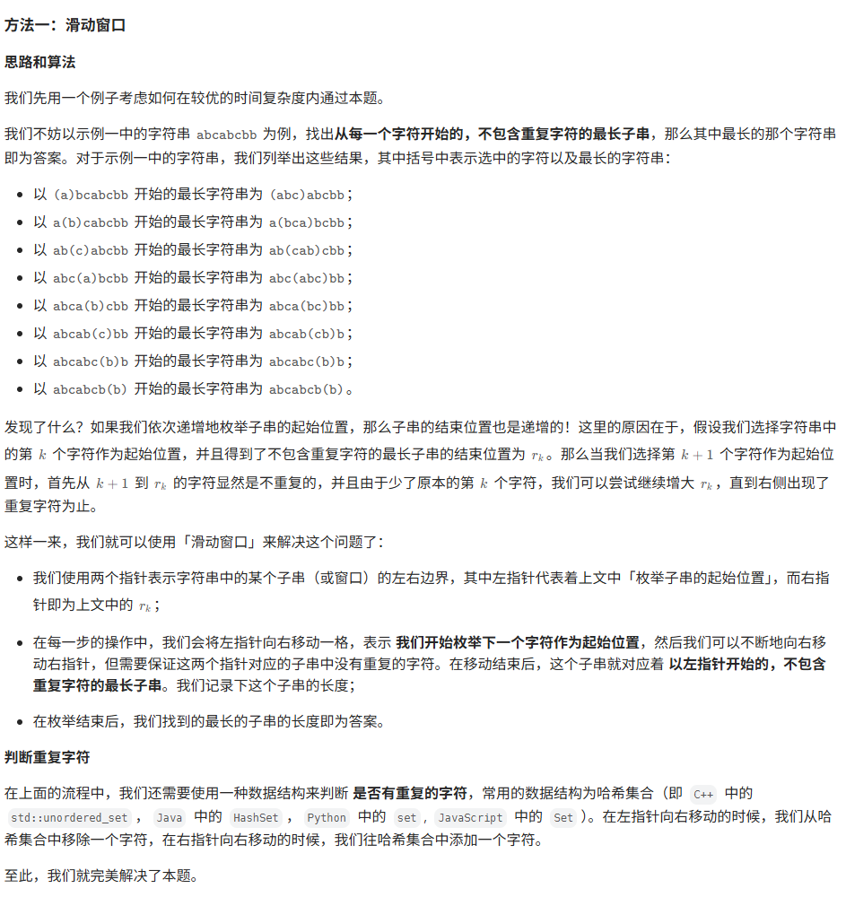

## 题目：

题目链接：[3. 无重复字符的最长子串](https://leetcode.cn/problems/longest-substring-without-repeating-characters/description/?envType=study-plan-v2&envId=top-100-liked)

题目描述：

> 给定一个字符串`s`，请你找出其中不含有重复字符的最长子串的长度。
> 子字符串是字符串中连续的非空字符序列。

## 思路：



## 代码：

```c++
class Solution {
public:
    int lengthOfLongestSubstring(string s) {
        // 哈希集合，记录每个字符是否出现过
        unordered_set<char> occ;
        int left=0, right=0, res=0;

        while(left<s.size()){
            if(left != 0){
                // 左指针向右移动一格，移除一个字符
                occ.erase(s[left-1]);
            }
            while(right < s.size() && !occ.count(s[right])){
                // 移动右指针
                occ.insert(s[right]);
                right++;
            }
            res = max(res, right-left);
            left++;
        }
        return res;
    }
};
```