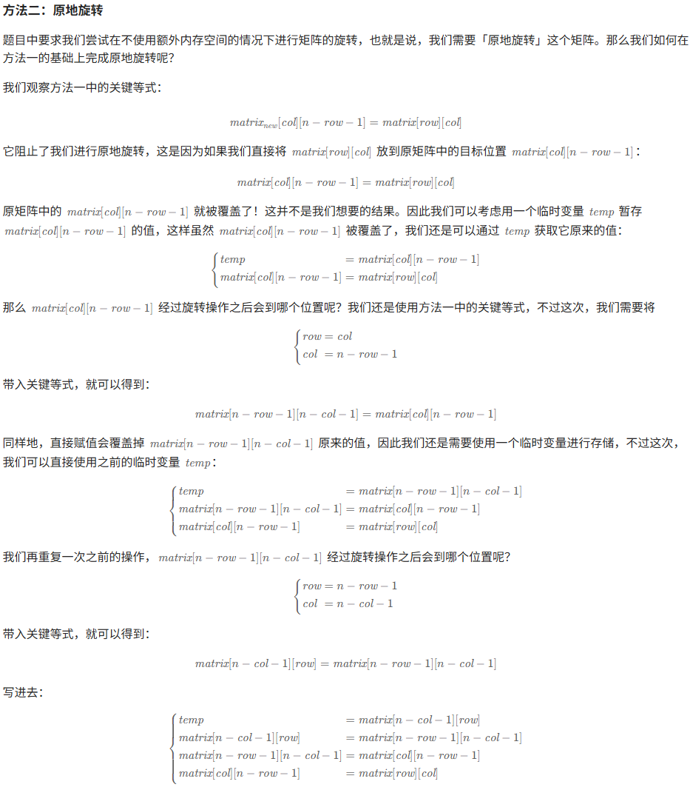
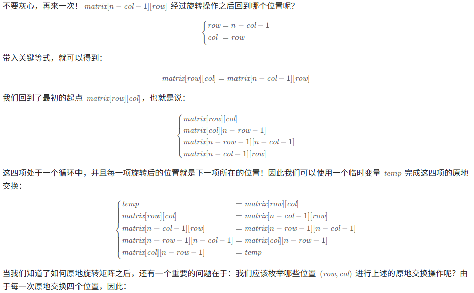
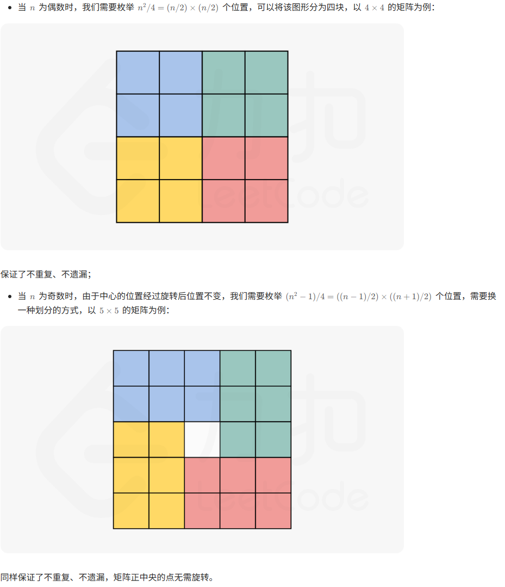

## 题目：

题目链接：[48. 旋转图像](https://leetcode.cn/problems/rotate-image/description/?envType=study-plan-v2&envId=top-100-liked)

题目描述：

> 给定一个`n × n`的二维矩阵`matrix`表示一个图像。请你将图像顺时针旋转`90`度。
> 你必须在**原地**旋转图像，这意味着你需要直接修改输入的二维矩阵。**请不要**使用另一个矩阵来旋转图像。

## 思路：







## 代码：

```c++
class Solution {
public:
    void rotate(vector<vector<int>>& matrix) {
        // // 使用辅助数组
        // vector<vector<int>> new_matrix=matrix;
        // int n=matrix.size();

        // for(int i=0; i<n; ++i){
        //     for(int j=0; j<n; ++j){
        //         new_matrix[j][n-i-1] = matrix[i][j];
        //     }
        // }

        // matrix = new_matrix;


        // 原地旋转
        int n = matrix.size();
        for (int i = 0; i < n / 2; ++i) {
            for (int j = 0; j < (n + 1) / 2; ++j) {
                int temp = matrix[i][j];
                matrix[i][j] = matrix[n - j - 1][i];
                matrix[n - j - 1][i] = matrix[n - i - 1][n - j - 1];
                matrix[n - i - 1][n - j - 1] = matrix[j][n - i - 1];
                matrix[j][n - i - 1] = temp;
            }
        }
    }
};
```