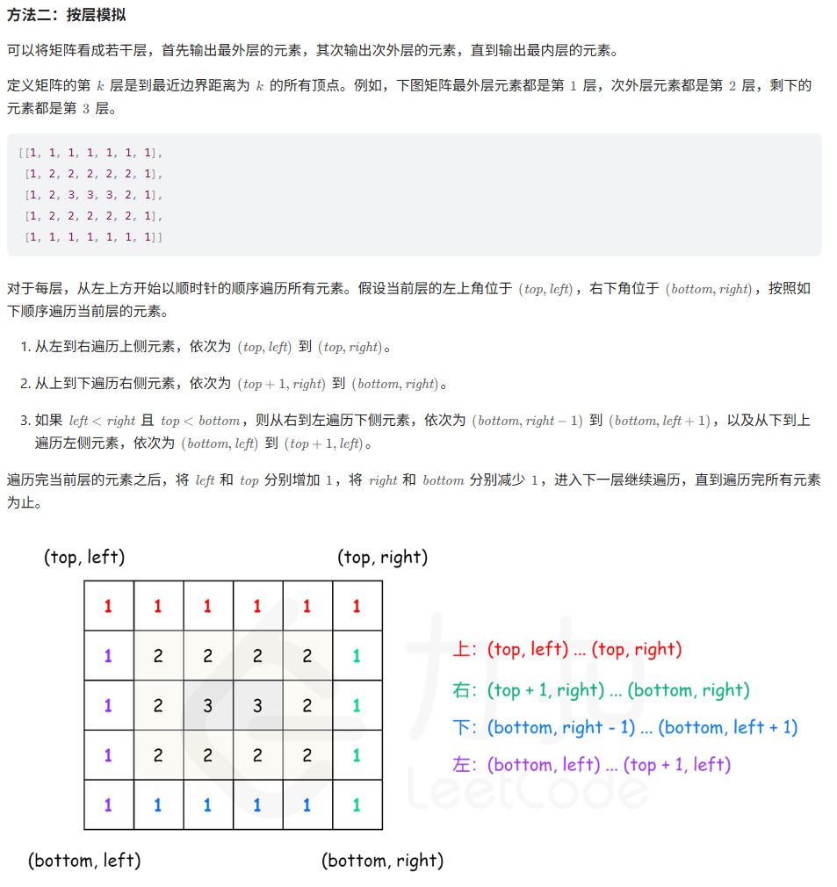

## 题目：

题目链接：[54. 螺旋矩阵](https://leetcode.cn/problems/spiral-matrix/description/?envType=study-plan-v2&envId=top-100-liked)

题目描述：

> 给你一个`m`行`n`列的矩阵`matrix`，请按照**顺时针螺旋顺序**，返回矩阵中的**所有元素**。

## 思路：

按层模拟：



## 代码：

```c++
class Solution {
public:
    vector<int> spiralOrder(vector<vector<int>>& matrix) {
        // 按层模拟
        if(matrix.size()==0 || matrix[0].size()==0)return {};

        int rows=matrix.size(), columns=matrix[0].size();
        vector<int> order;
        int left=0, right=columns-1, top=0, bottom=rows-1;

        while(left<=right && top<=bottom){
            for(int column=left; column<=right; ++column){
                order.push_back(matrix[top][column]);
            }
            for(int row=top+1; row<=bottom; ++row){
                order.push_back(matrix[row][right]);
            }
            // 注意这里的判断条件
            if(left<right && top<bottom){
                for(int column=right-1; column>=left; --column){
                    order.push_back(matrix[bottom][column]);
                }
                for(int row=bottom-1; row>top; --row){
                    order.push_back(matrix[row][left]);
                }
            }
            left++;
            right--;
            top++;
            bottom--;
        }

        return order;
    }
};
```